# Guion — Video de Cierre del Proyecto Semestral (SAGAF Grupo C)

> Scrum Review + Spick · máximo 10 minutos · los 4 integrantes en cámara.
> Duración estimada total: ~8:50 min (deja margen antes de los 10 min).
>
> **Ubicación de las capturas:** carpeta [`docs/guion_capturas/`](guion_capturas/) del repositorio (ruta completa: `docs/guion_capturas/<archivo>.png`). Cada quien narra su parte mostrando en pantalla estas imágenes (compartirlas a pantalla completa, o abrir el Anexo A del informe final) en vez de hacer la demo en vivo sobre su propia app: como la base de datos no se comparte por git (está en `.gitignore`), cada máquina tiene datos distintos o vacíos, y estas capturas ya muestran el mismo caso de ejemplo para los cuatro. Debajo de cada oración clave va la captura que corresponde mostrar en ese momento, con su nombre de archivo.

---

## [00:00–00:50] Apertura — Kelvin He

> "Hola, buenas tardes profesora Mosquera. Somos el equipo SAGAF Grupo C: yo soy Kelvin He, y me acompañan Einer Mosquera, Yasiel Gómez y Francisco Herrera. Hoy les vamos a mostrar el cierre del proyecto semestral de SAGAF, el Sistema Automatizado de Gestión de Análisis Financiero para la Unidad de Análisis Financiero de Panamá. En el Parcial 2 entregamos un sistema funcional con ocho casos de uso implementados y ciento veinticinco pruebas automatizadas. Para este cierre, tomamos dos observaciones puntuales que usted nos hizo en esa entrega y las convertimos en código real, que les vamos a demostrar en vivo ahora mismo."

*Pantalla: mostrar la siguiente captura (vista general del portal).*

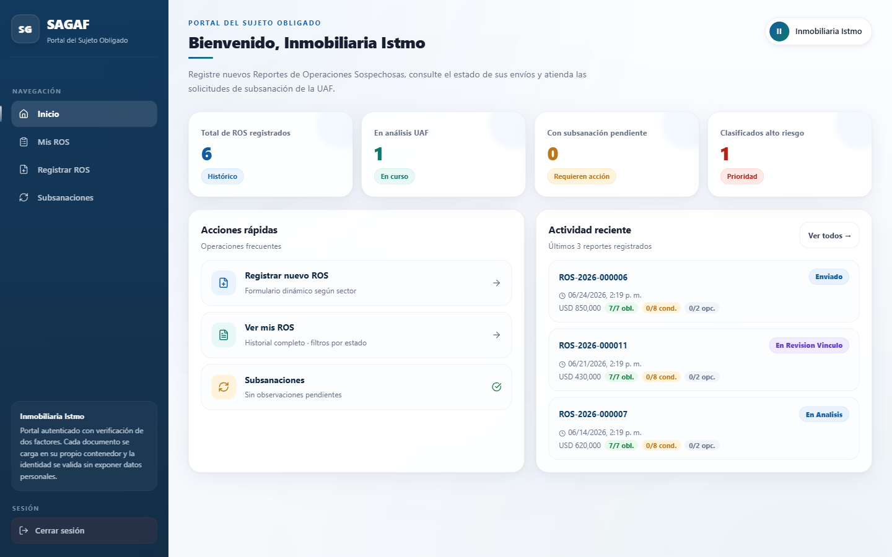
**Captura:** Inicio del portal del Sujeto Obligado, con el historial de ROS registrados. — `docs/guion_capturas/01-portal-dashboard.png`

---

## [00:50–02:20] Kelvin He — Verificación de nombre y contenido de documentos

*(Pantalla: mostrar en orden las capturas de nuevo ROS y la advertencia de contenido)*

> "Lo primero que ajustamos fue la carga documental. Antes, el sistema aceptaba cualquier archivo bajo cualquier nombre en los contenedores de documentos del ROS. Se los muestro: aquí estoy en el portal, registrando un nuevo ROS de una inmobiliaria."

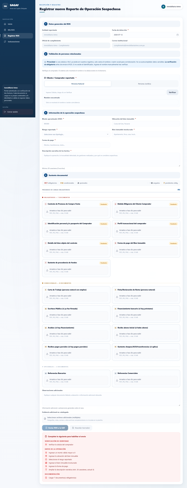
**Captura:** Formulario dinámico "Registrar nuevo ROS", con los contenedores de sustento documental. — `docs/guion_capturas/02-portal-nuevo-ros.png`

> "Subo el documento correcto en el primer contenedor, 'Contrato de Promesa de Compra Venta', y el sistema lo marca como Listo. Ahora, en el segundo contenedor, que pide 'Debida Diligencia del Cliente Comprador', voy a subir a propósito una cédula de identidad. Miren lo que pasa: el sistema me advierte, primero, que el nombre del archivo no corresponde, y segundo —esto es lo importante— que leyó el contenido del PDF con OCR y las palabras que encontró no coinciden con lo que se espera para ese documento."

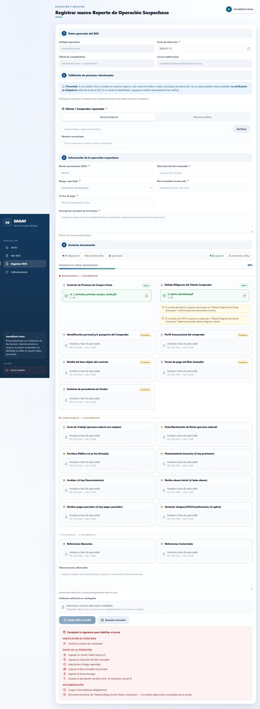
**Captura:** Formulario completo — documento 1 "Listo ✓" (correcto) y documento 2 con advertencia (incorrecto). — `docs/guion_capturas/03-verificacion-contenido-documento.png`

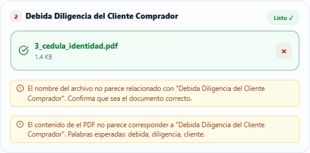
**Captura:** Acercamiento a la tarjeta del documento 2 — advertencia de nombre de archivo y de contenido OCR. — `docs/guion_capturas/03b-verificacion-contenido-zoom.png`

> "No bloquea el envío, porque preferimos que un analista humano revise el caso dudoso antes que impedirle a un banco reportar una operación sospechosa real. Por dentro, esto usa pdfjs para leer la capa de texto del PDF, y cuando el documento es una imagen o un escaneo, usa Tesseract con un preprocesado que le quita el fondo de seguridad a la cédula para que el OCR pueda leerla. Lo que aprendí implementando esto es que validar no es lo mismo que bloquear: el sistema tiene que fallar de forma segura, avisando pero sin cerrarle la puerta al usuario legítimo."

---

## [02:20–03:50] Einer Mosquera — Módulo de Supervisión y flujo de auditoría

*(Pantalla: mostrar el módulo de Supervisión en vivo — ya está en main)*

> "La segunda observación de la profesora fue sobre el flujo de auditoría: teníamos un log de auditoría, pero no estaba conectado a nada externo, solo era una consulta libre. Trabajé eso en una rama aparte, que se llama flujo-auditoria, y que ya se fusionó a main mediante el Pull Request 43. Lo que construí es un módulo de Supervisión: cuando un organismo como la Superintendencia de Bancos le envía un oficio a un sujeto obligado pidiendo información, el sistema lee ese oficio con OCR, extrae automáticamente el alcance —por ejemplo, qué período o qué ROS específicos pide— y arma un paquete de respuesta en PDF con el nivel de detalle correcto. Se los muestro registrando un oficio real."

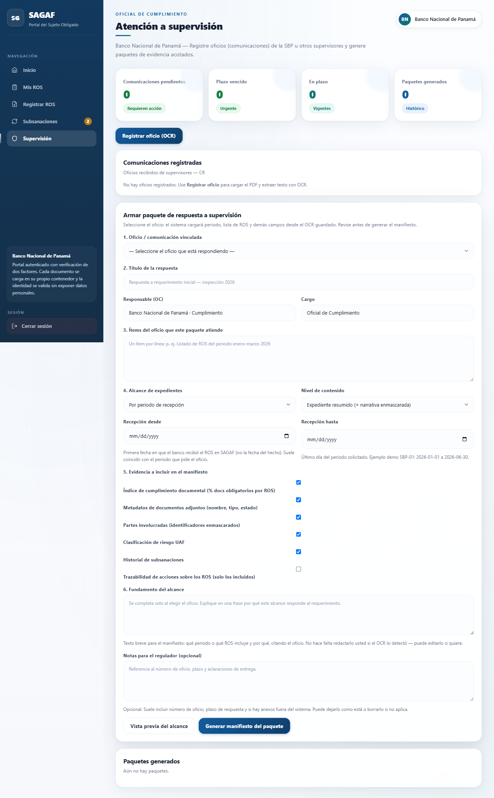
**Captura:** Módulo "Atención a supervisión" — panel inicial. — `docs/guion_capturas/22-supervision-portal.png`

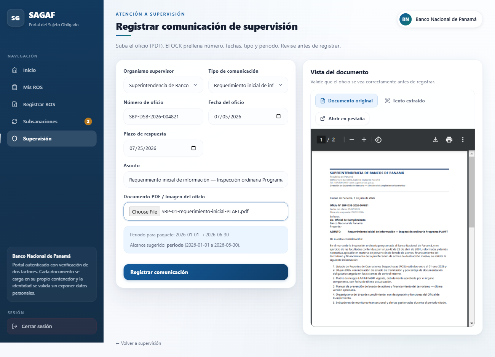
**Captura:** Registro de un oficio real (SBP-01) — el OCR prellena número, fechas, asunto y periodo. — `docs/guion_capturas/23-supervision-ocr-oficio.png`

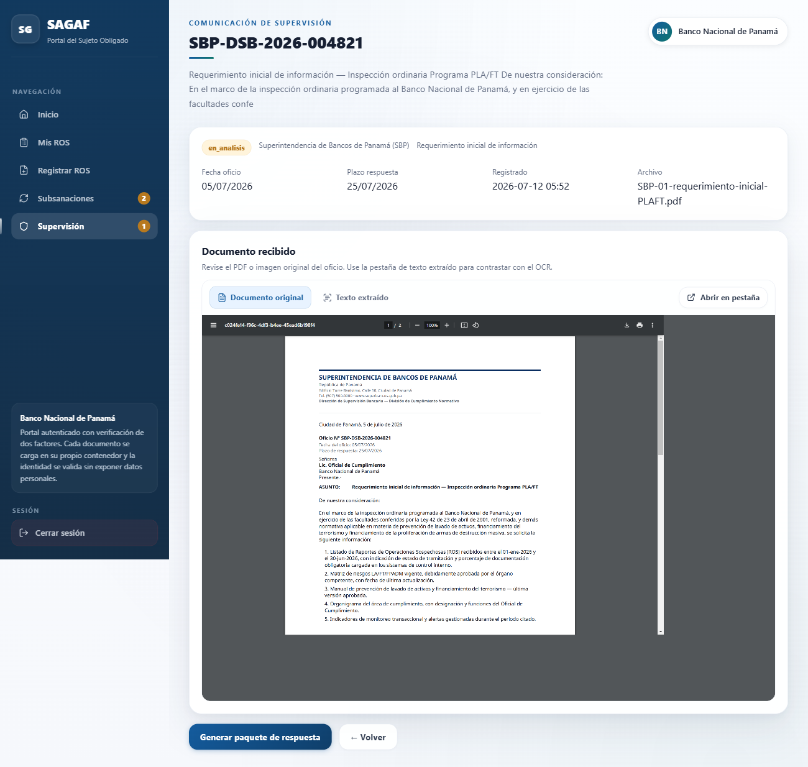
**Captura:** Detalle de la comunicación de supervisión registrada. — `docs/guion_capturas/24-supervision-comunicacion-detalle.png`

> "Y aquí está la parte que conecta con la auditoría: en vez de dejar un log de consulta libre abierto, lo oculté detrás de una bandera de funcionalidad, AUDIT_LOG_UI, mientras se integra formalmente a este flujo de supervisión. El registro en la base de datos sigue siendo inmutable, eso no cambió; lo que cambió es quién y cómo lo consulta. Esta parte me enseñó que auditar no es solo guardar el log, es pensar para quién es útil y con qué propósito."

---

## [03:50–05:20] Yasiel Gómez — Bandeja UAF, completitud documental y reportes

*(Pantalla: mostrar en orden las capturas de bandeja, riesgo y reportes)*

> "Yo trabajé del lado de la bandeja de la UAF y los reportes. Aquí estoy en la bandeja de análisis: vean que cada ROS muestra su nivel de completitud documental, cuántos documentos obligatorios tiene cargados, y el cliente aparece enmascarado, así, con asteriscos, por la Ley 81 de protección de datos."

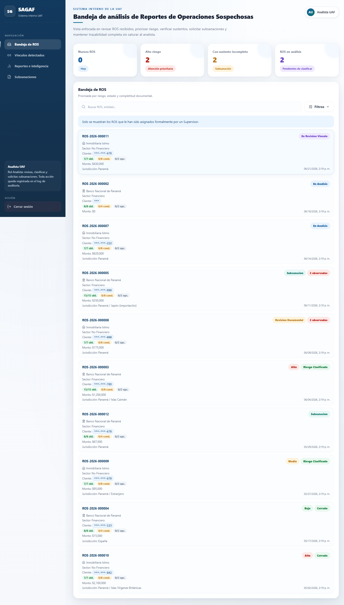
**Captura:** Bandeja de análisis de la UAF (rol Analista) — ROS priorizados con identificadores enmascarados. — `docs/guion_capturas/05-uaf-bandeja.png`

> "Entro a un expediente de alto riesgo... aquí se ve el resumen, las partes involucradas también enmascaradas, y la pestaña de Riesgo con la clasificación y su justificación, que queda guardada en el historial."

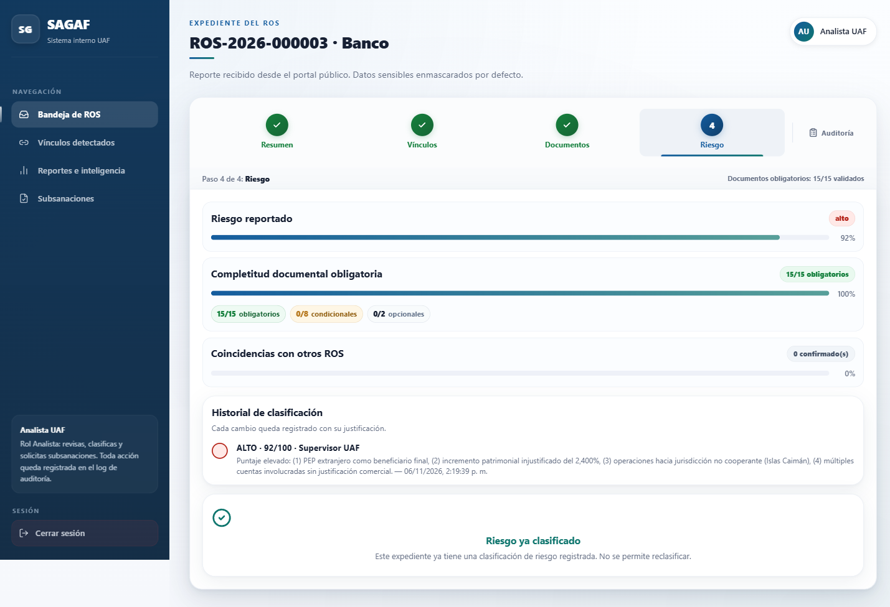
**Captura:** Expediente del ROS — pestaña Riesgo, con la clasificación justificada. — `docs/guion_capturas/07-uaf-riesgo.png`

> "Ahora les muestro los reportes: como supervisor puedo exportar un reporte en CSV, y esa exportación sale con marca de agua, los datos enmascarados, y cada descarga queda registrada en el log de auditoría."

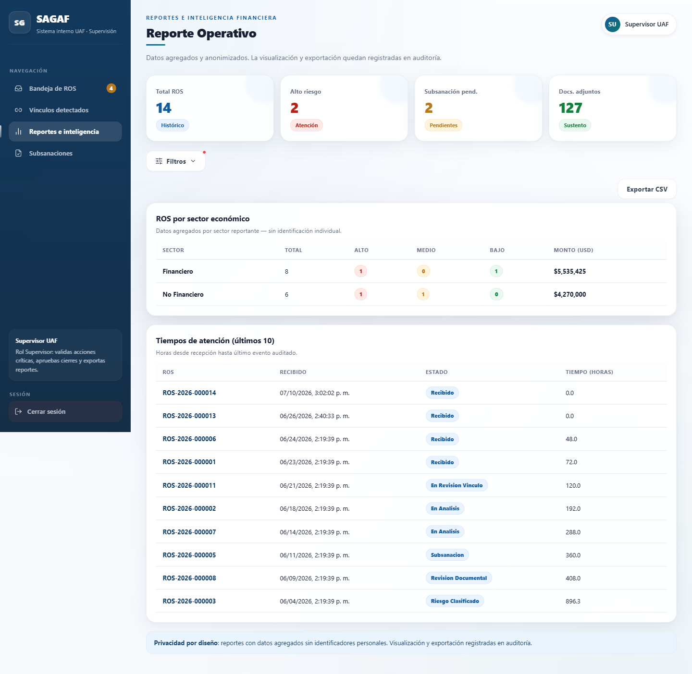
**Captura:** Reportes e inteligencia financiera (rol Supervisor) — exportación CSV controlada y auditada. — `docs/guion_capturas/11-uaf-reportes.png`

> "Nada de esto se descarga 'por si acaso' sin dejar rastro. Lo que más aprendí en este cierre fue lo importante que es no hacer atajos con datos sensibles: cada vez que quise agregar una columna nueva al reporte tuve que preguntarme si de verdad hacía falta mostrarla, o si bastaba con el dato enmascarado."

---

## [05:20–06:50] Francisco Herrera — Aseguramiento de calidad y pruebas automatizadas

*(Pantalla: mostrar la captura de terminal con la suite de pruebas)*

> "Yo soy el QA del equipo, así que mi parte no es una pantalla nueva sino la evidencia de que todo lo que ellos mostraron realmente funciona. Tenemos ciento veinticinco pruebas automatizadas con Vitest, más cinco escenarios completos de extremo a extremo con Playwright, que simulan el flujo entero: un ROS se registra, pasa a análisis, se le clasifica el riesgo, se le pide una subsanación, se cierra el caso, y al final se verifica que el log de auditoría sea inmutable."

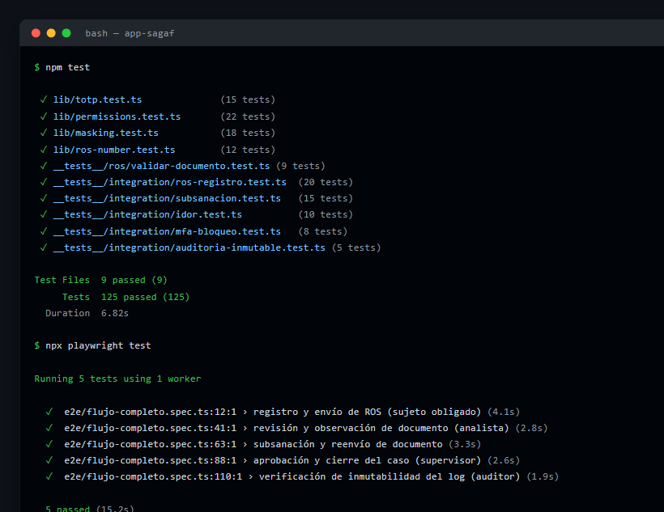
**Captura:** Terminal — `npm test` (Vitest) y `npx playwright test`, 125 pruebas y 5 escenarios E2E en verde. — `docs/guion_capturas/terminal-tests.png`

> "Para este cierre corrí pruebas de regresión específicamente sobre el módulo de verificación de documentos y sobre la exportación de reportes, para confirmar que los ajustes de Kelvin y Yasiel no rompieron nada que ya funcionaba. También mantenemos una matriz de defectos: de los quince defectos originales del documento académico, trece ya están mitigados con código y con una prueba que lo demuestra. Lo que aprendí siendo el único QA del equipo es que no se puede probar todo con la misma profundidad; hay que priorizar los defectos críticos y los flujos de negocio completos antes que los casos raros de baja severidad."

---

## [06:50–08:50] Cierre grupal — Retrospectiva (Spick: ¿qué problemas tuvieron?)

*(Pantalla opcional: tablero Kanban del proyecto, como cierre visual del trabajo del equipo)*

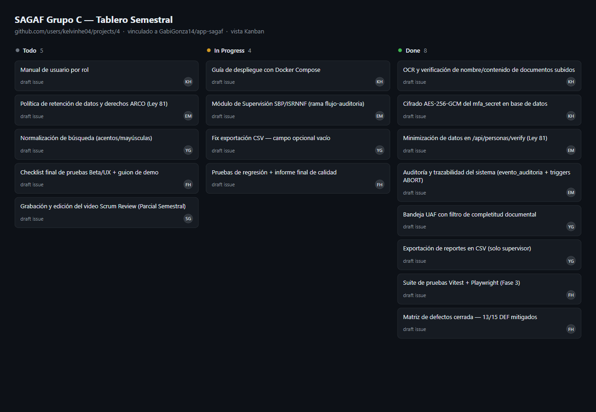
**Captura:** Tablero Kanban del proyecto en GitHub Projects (Todo / In Progress / Done). — `docs/guion_capturas/12-kanban-tablero.png`

> **Kelvin:** "Como retrospectiva rápida: lo más difícil este semestre fue coordinar cuatro personas con roles distintos sobre un documento base que nos entregó el arquitecto de otro grupo, Gabriel González, y que dejaba varias decisiones abiertas."
>
> **Einer:** "A mí lo que más me costó fue que el OCR real, con cédulas y oficios que tienen fondos de seguridad, es mucho más difícil de lo que parece en teoría; tuvimos que hacer preprocesado de imagen para que funcionara de verdad. Y trabajar en una rama separada tanto tiempo, sin integrarla a main hasta último momento, nos obligó a ser disciplinados con el checklist de pull request para no arriesgar lo que ya estaba entregado — la fusionamos apenas unos días antes de este cierre."
>
> **Yasiel:** "A mí lo que más me costó fue decidir qué campo sí y qué campo no va en un reporte exportable; cada vez que se me ocurría agregar uno nuevo tenía que revisarlo contra el criterio de enmascarado de la Ley 81 antes de dejarlo pasar."
>
> **Francisco:** "Del lado de QA, el reto fue mantener las ciento veinticinco pruebas en verde mientras el resto del equipo seguía agregando funcionalidad hasta el último momento del semestre."
>
> **Kelvin:** "Con esto cerramos el proyecto SAGAF. Gracias, profesora Mosquera, por la retroalimentación del Parcial 2, que fue la que guio estos dos ajustes finales."

---

### Índice de capturas (docs/guion_capturas/)

| Archivo | Descripción |
|---|---|
| `01-portal-dashboard.png` | Inicio del portal del Sujeto Obligado |
| `02-portal-nuevo-ros.png` | Formulario "Registrar nuevo ROS" |
| `03-verificacion-contenido-documento.png` | Advertencia de contenido no correspondiente (documento 2) |
| `03b-verificacion-contenido-zoom.png` | Acercamiento a la advertencia de nombre/contenido |
| `22-supervision-portal.png` | Módulo de Supervisión — panel inicial |
| `23-supervision-ocr-oficio.png` | Registro de oficio con OCR (SBP-01) |
| `24-supervision-comunicacion-detalle.png` | Detalle de la comunicación de supervisión registrada |
| `05-uaf-bandeja.png` | Bandeja de análisis de la UAF |
| `07-uaf-riesgo.png` | Expediente — pestaña Riesgo |
| `11-uaf-reportes.png` | Reportes — exportación CSV auditada |
| `terminal-tests.png` | Terminal — resultados de la suite de pruebas |
| `12-kanban-tablero.png` | Tablero Kanban del proyecto |

### Notas de grabación
- **No hace falta demo en vivo.** La base de datos (`db/sagaf.db`) y los uploads (`var/uploads/`) están en `.gitignore`, así que no viajan con el `git push`: cada máquina tiene datos distintos (o ninguno) hasta que corran el seed. Para que los cuatro muestren el mismo caso sin depender de eso, cada quien narra su parte con las capturas de `docs/guion_capturas/` en pantalla (compartir las imágenes directamente, a pantalla completa, o abrir el Anexo A del informe final y navegar hasta su sección).
- Si alguien prefiere igual mostrar su propia app corriendo en vivo, puede hacerlo: `npm run db:init` + `npm run db:seed` deja la base con los 6 usuarios y **12 ROS demo ya precargados** (ROS-001 a ROS-012, entre Banco Nacional e Inmobiliaria Istmo) — no hace falta crear ROS a mano. Para ver el módulo de Supervisión de Einer con datos reales, usar los PDF de ejemplo en `test-docs/supervision/`.
- **Importante:** el módulo de Supervisión de Einer ya está en `main` (PR #43) — no hace falta cambiar de rama para grabarlo. El rol Auditor y la pestaña "Auditoría" del expediente sí están deshabilitados por defecto en este MVP (feature flags `AUDITOR_UI` / `AUDIT_LOG_UI` en `lib/features.ts`).
- El cierre grupal puede grabarse junto (videollamada) o cada quien su línea por separado y editarlo en secuencia.
- Subir a YouTube o Drive con acceso público/institucional antes del lunes 13 de julio, 12:00 pm.
